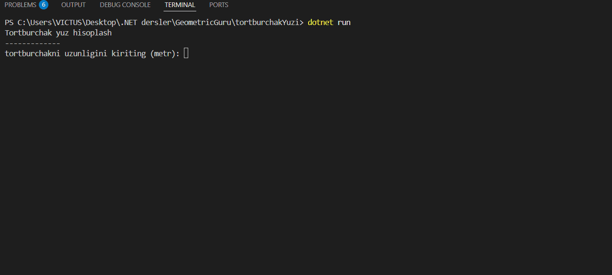

##  Dastur nima ish qiladi?
Bu dastur to'g'ri to'rtburchak shaklidagi har qanday joyning (masalan, hovli yoki xona) maydonini hisoblab beradi.

##  Qanday ishlaydi?
1. Dastur foydalanuvchidan joyning **uzunligini** raqamda kiritishni so'raydi.
2. Keyin **kengligini** so'raydi.
3. Kiritilgan ikkita raqamni bir-biriga ko'paytiradi (`yuza = uzunlik * kenglik`).
4. Va tayyor natijani ekranga chiqarib beradi.

<<<<<<< HEAD

=======
>>>>>>> 87d262075ce44fa01dac5c63bfea704c224d4477

Arifmetik amallar  mavzu uchun 

# GeometryGru

Bu loyiha geometrik shakllarni hisoblash uchun sodda va tushunarli vositadir.

## Asosiy Amallar

Dasturda quyidagi matematik amallar ishlatiladi:

* **+ (Qo'shish):** Perimetrni hisoblash.
* **- (Ayirish):** Farqlarni topish.
* **\* (Ko'paytirish):** Yuza (maydon) hisoblash.
* **/ (Bo'lish):** Radius yoki nisbatlarni aniqlash 

