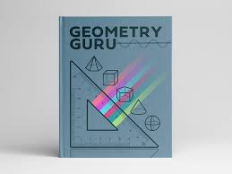

Arifmetik amallar  mavzu uchun 

# GeometryGru

Bu loyiha geometrik shakllarni hisoblash uchun sodda va tushunarli vositadir.

## Asosiy Amallar

Dasturda quyidagi matematik amallar ishlatiladi:

* **+ (Qo'shish):** Perimetrni hisoblash.
* **- (Ayirish):** Farqlarni topish.
* **\* (Ko'paytirish):** Yuza (maydon) hisoblash.
* **/ (Bo'lish):** Radius yoki nisbatlarni aniqlash 
